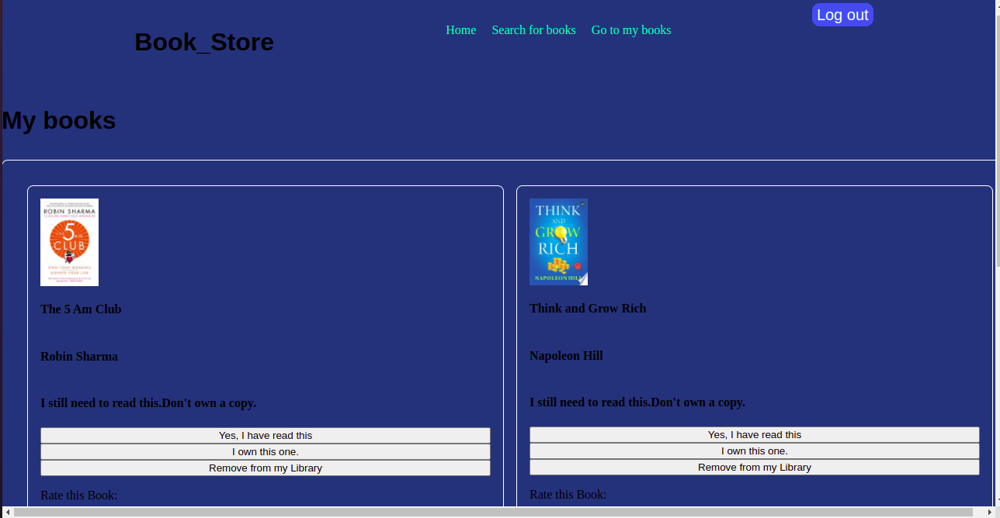

# README

## MY_BOOK_STORE PROJECT

## Description
This is a Book store project in which the user is able to perform the following operations.
- A user can register and Log in to the system
- A user can search for their favorite books
- A user can add that book to their Library
- Through a GotoMy Books link, the user is able to access saved books
- The User can then rate that book, update or delete that rating
- A user can indicate whether they have read or whether they own that book.
-And finally a user can remove that book from their library.

## Access to the Front End
- Front here part -[here](https://github.com/VincentLangat033/my-book-store-frontend)
 - Feel free to contribute!

<h1> Setup/Installation Requirements </h1>
<ol>
<li>Clone the project using git -clone https://github.com/VincentLangat033/my-book-store-backend  If you are not able to clone it, you can download the files as a zip folder</li>

 <li> Ensure that you have access to the complete file</li>

</ol>
<h1> Technologies Used</h1>

### Ruby

## Project Guidelines
This  project should conform to the following set of guidelines:

## Models
### It creates the following relationships:

- A `Book` has many `bookselves`s through `user_bookshelves`, source `user`
- A `Book` has many `ratings`s through `user_ratings`, source `user`

- A `User` has many `rated_books` through `ratings`, source `book`

- A `Comment` belongs to a `User` and belongs to a `book`

# Screen Shot of the Book Store

# Known Bugs
- There are no known bugs on the back-end part of this project. However, the front end part of it is yet to be complete . Watch out for it!

## License
Copyright (c) [2022] [Vincent Kimutai Langat] Permission is hereby granted, free of charge, to any person obtaining a copy of this software and associated documentation files (the "Software"), to deal in the Software without restriction, including without limitation the rights to use, copy, modify, merge, publish, distribute, sublicense, and/or sell copies of the Software, and to permit persons to whom the Software is furnished to do so, subject to the following conditions:

The above copyright notice and this permission notice shall be included in all copies or substantial portions of the Software.

THE SOFTWARE IS PROVIDED "AS IS", WITHOUT WARRANTY OF ANY KIND, EXPRESS OR IMPLIED, INCLUDING BUT NOT LIMITED TO THE WARRANTIES OF MERCHANTABILITY, FITNESS FOR A PARTICULAR PURPOSE AND NONINFRINGEMENT. IN NO EVENT SHALL THE AUTHORS OR COPYRIGHT HOLDERS BE LIABLE FOR ANY CLAIM, DAMAGES OR OTHER LIABILITY, WHETHER IN AN ACTION OF CONTRACT, TORT OR OTHERWISE, ARISING FROM, OUT OF OR IN CONNECTION WITH THE SOFTWARE OR THE USE OR OTHER DEALINGS IN THE SOFTWARE.

## Author
By Vincent Kimutai.

## Support-And-Contact-Details
Email address: kimutaiketer033@gmail.com | 